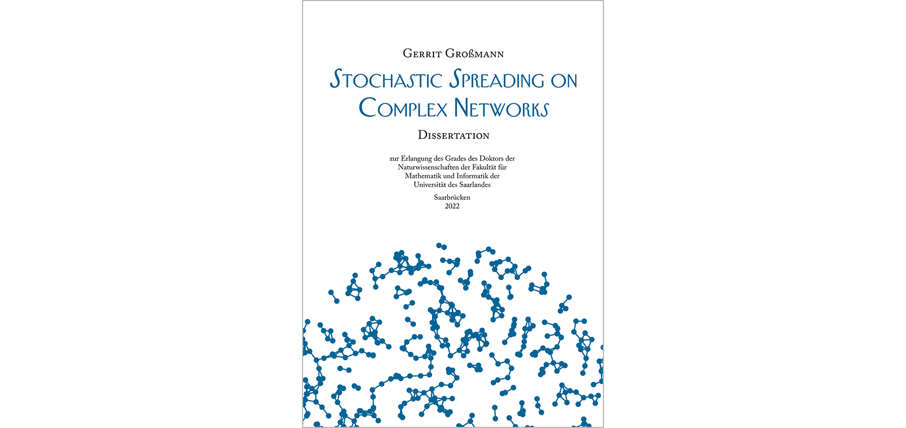

# Dissertation - Stochastic Spreading on Complex Networks
Official repository for [Gerrit's](https://mosi.uni-saarland.de/people/gerrit/) dissertation. 

## Files
* `dissertation.pdf` -> Review version of the dissertation
* `errata.txt` -> List of corrections

## About
The LaTeX version is available upon request. 
I used the wonderful [Clean Thesis](http://cleanthesis.der-ric.de/) template for writing and the beautiful [AMS Euler](https://de.wikipedia.org/wiki/AMS_Euler) math font. 

## About

*Part I: Preliminaries*
* Introduction
* Background

*Part II: Simulation and Control*
* Simulation of Markovian Spreading
* Simulation of non-Markovian Spreading
* Vaccine Allocation Optimization
* Covid-19 and the Limitations of Modeling

*Part III: Reduction and Inference*
* Birth-Death Process Abstraction
* From Networks to Population Models
* Neural Relational Inference

*Part IV: Concluding Remarks*
* Conclusion
